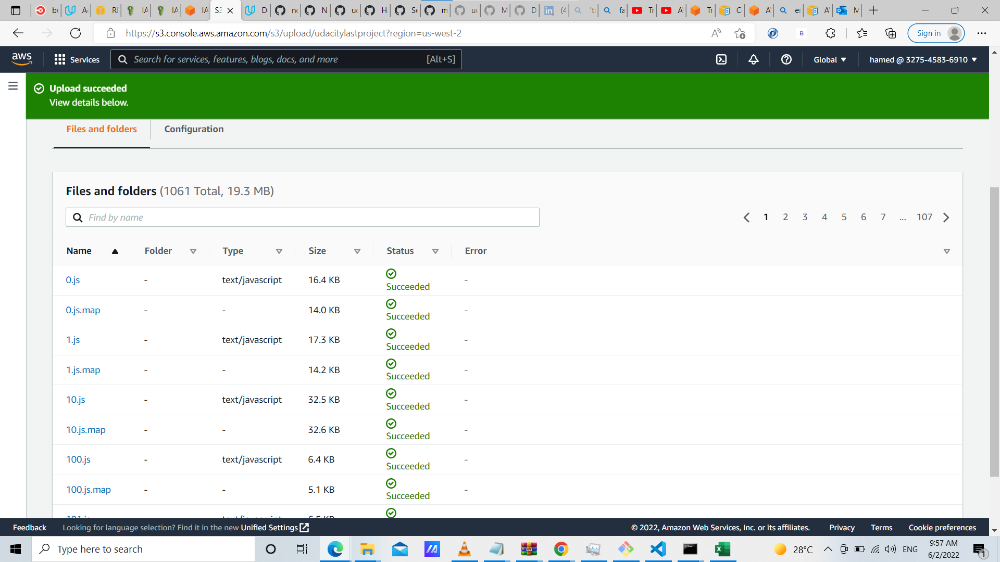
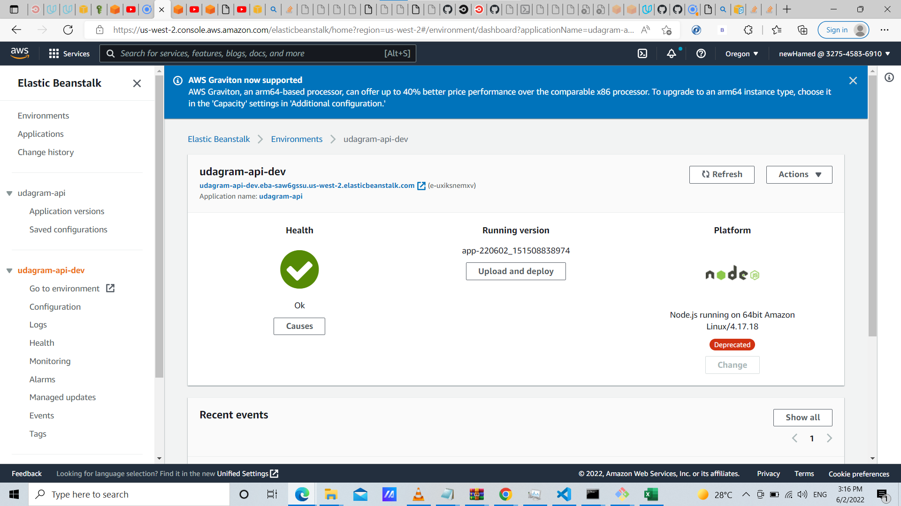
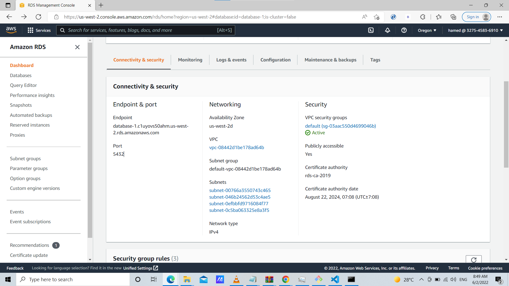

# Udagram Infrastructure

Udagram application is hosted on aws cloud services (S3 bucket , Elastic bean stack and RDS postgres)

## S3 bucket

Application front-end is hosted on a S3 bucket

Site URL : [link](http://finalversion.s3-website-us-west-2.amazonaws.com/)

## Elastic bean stack

App server is deployed on elastic bean service

Endpoint : [link](http://udagram-api-dev.eba-saw6gssu.us-west-2.elasticbeanstalk.com/)

## RDS postgres

App server uses a database provided on postgres RDS

