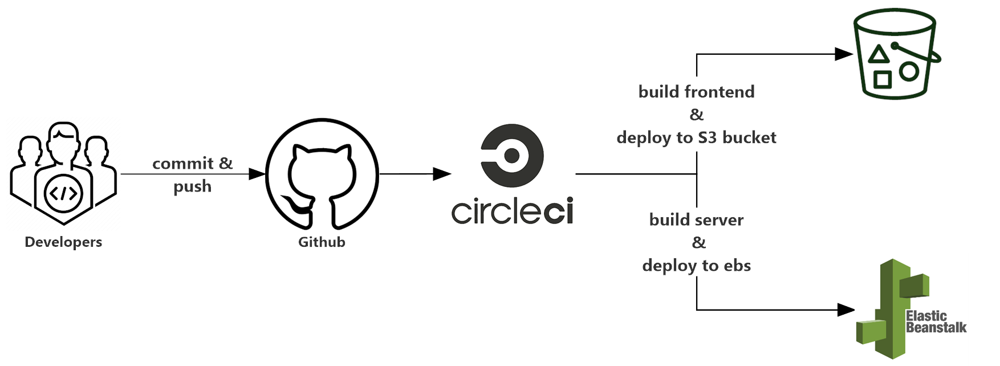
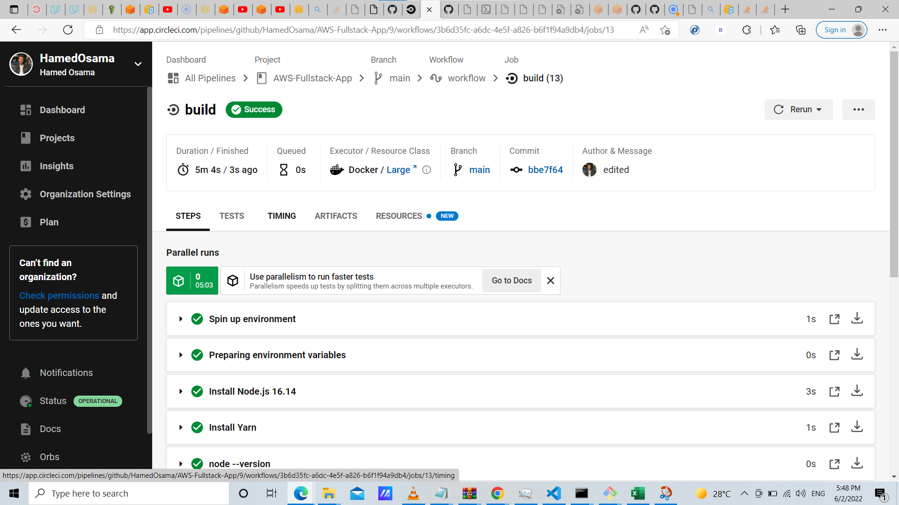
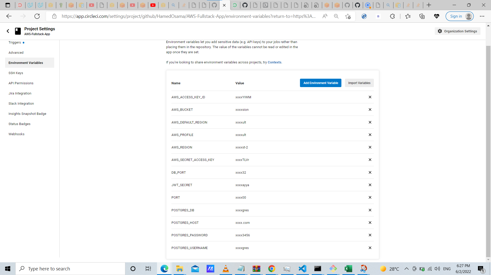

# Udagram Pipeline

This project implies CI/CD as a best practice for devops teams automating integration and delivery.By installing dependencies ,building products and deploying into production environment.

## CircleCi Deployment

CircleCI deployment steps and result

## Environment Variables

Environment variables is passed to elastic bean stack app server from circleCI application

